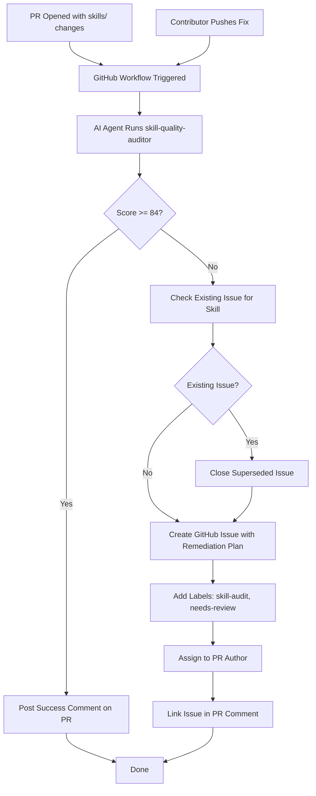

# GitHub Workflow for Automated Skill Auditing

## Goal

Create a GitHub Actions workflow that triggers skill quality audits using `skill-quality-auditor` when PRs modify files in `./skills/`, creates GitHub Issues for remediation plans when audits fail, and stores audit reports. Contributors resolve issues locally by pushing fixes; the workflow re-audits on each push to verify fixes.

## Context

- Repository uses `skill-quality-auditor` with 8-dimension scoring framework
- Local audit reports: `.context/audits/<skill-name>-audit-YYYY-MM-DD.md`
- Local remediation plans: `.context/plans/<skill-name>-remediation-plan.md`
- Must invoke an AI agent available on the repository (Copilot, Gemini, Codex, etc.)
- Audit only the specific skill that was modified in the PR
- **Design Decision**: Remediation is resolved locally by contributors; workflow re-audits on each push to verify fixes

## Recommended Flow

### Abuse Prevention Controls

- Only create issues when audit score < 84 (failing threshold)
- Check for existing open issue for the same skill before creating new one
- Label issues with "skill-audit", "needs-review", "remediation"
- Assign issue to PR author for accountability
- Close superseded issues when new audit runs on same skill

### Issue Resolution Flow

- Issue contains remediation plan with actionable steps
- Contributor addresses issues locally, commits fixes
- Next push to PR triggers re-audit (workflow runs again)
- If score >= 84, close the issue automatically
- If score still < 84, update issue with new audit results

### Mermaid Diagram



## Inputs

- Available scripts: `evaluate.sh`, `audit-skills.sh`, `validate-review-format.sh`, `validate-remediation-plan.sh`
- Templates: `review-report-template.yaml`, `remediation-plan-template.yaml`
- Schema: `remediation-plan.schema.json`
- Path to skills: `./skills/`

## Deliverables

- `.github/workflows/skill-audit-pr.yaml` - Workflow file with path filters for `./skills/` directory
- Audit report stored as workflow artifact or committed to `.context/audits/`
- GitHub Issue with abuse prevention (deduplication, labels, assignment)
- PR comment with audit summary and issue link

## Constraints & Limitations

- Use GitHub-native features only (Actions, Issues, PRs)
- Follow existing skill-quality-auditor format conventions
- Audit only changed skills (filter by path changes in PR)
- Respect API rate limits and usage quotas
- Do not modify skill files directly
- Do not commit secrets or credentials to workflow

## Quality Standards & Acceptance Criteria

- Workflow triggers only on PRs modifying `./skills/` path
- Audit report follows `review-report-template.yaml` format
- Remediation plan follows `remediation-plan-template.yaml` format
- Remediation plan validates against `remediation-plan.schema.json`
- PR comment clearly shows score and pass/fail status
- Issue is created only when score < 84
- Existing issues are checked and closed/reused appropriately
- Workflow fails gracefully with clear error messages

## Style & Tone

- Technical, concise, for senior engineers
- Focus on automation reliability and maintainability
- Include inline comments in workflow YAML

## Clarifying Questions

- Should audit reports be committed to the repository or kept as workflow artifacts only?
- Which AI agent should be invoked by default (Copilot, Gemini, Codex)?
- Should the workflow run on `pull_request_target` for forked PRs?

## Example Output

### Workflow YAML Snippet

```yaml
name: Skill Audit on PR

on:
  pull_request:
    paths:
      - 'skills/**'

jobs:
  audit-skill:
    runs-on: ubuntu-latest
    steps:
      - uses: actions/checkout@v4
      - name: Run Skill Audit
        run: |
          # Extract changed skill name from PR
          # Run skill-quality-auditor evaluate.sh
          # Post results to PR
```

### PR Comment Example

```text
## Skill Quality Audit

**Skill**: `skill-quality-auditor`
**Score**: 78/120 (D - Below Passing)

### Results
- Framework: 10/15
- Documentation: 8/15
- [..remaining dimensions..]

### Action Required
Score below passing threshold (84). Remediation plan created: [#12](https://github.com/owner/repo/issues/12)
```

## Do Not Do

- Do not modify skill files directly in the workflow
- Do not create new report/plan formats outside existing templates
- Do not skip validation of remediation plans against schema
- Do not create duplicate issues for the same skill

## Assumptions

- Repository already has GitHub Actions enabled
- AI agent (Copilot/Gemini/Codex) is configured and available
- skill-quality-auditor scripts are executable
- GITHUB_TOKEN is available for workflow
