## Tessl CLI - Comprehensive Technical Report

Tessl is a CLI tool for managing reusable agent skills—a package manager specifically designed for AI agent capabilities. The CLI enables developers to discover, install, publish, and evaluate skill tiles for various AI coding assistants.

## Overview

Tessl operates as a registry-based package manager where skills are packaged as **tiles** and distributed through a centralized registry at `tessl.io`. The CLI provides commands for authentication, tile/skill management, evaluation, workspace organization, and integration with coding agents.

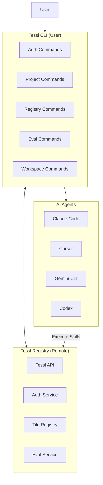

## Core Concepts

### Tiles

A **tile** is the fundamental unit of distribution in Tessl. Tiles can contain:
- **Skills** - Reusable agent capabilities with instructions and examples
- **Documentation** - Reference materials and guides
- **Rules** - Linting rules and code quality standards

Tiles follow the naming convention `workspace/tile-name` (e.g., `pantheon-org/my-skill`).

### Skills

A **skill** is the core executable capability packaged within a tile. Skills contain:
- `SKILL.md` - Primary entry point with skill description
- `AGENTS.md` - Agent-specific navigation
- `references/` - Supporting documentation
- `templates/` - Reusable templates (YAML)
- `schemas/` - JSON schemas for validation
- `scripts/` - Utility scripts (shell)

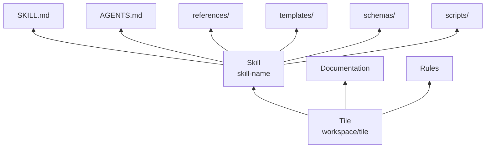

## Command Architecture

The Tessl CLI organizes its functionality into command groups:

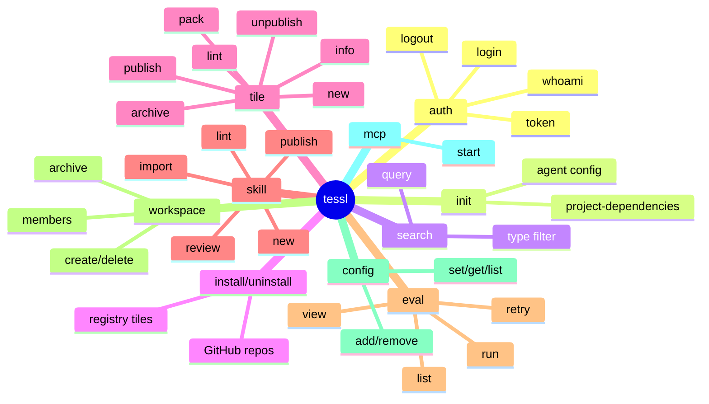

## Command Group Details

### 1. Authentication (`tessl auth`)

Manages user identity and API access.

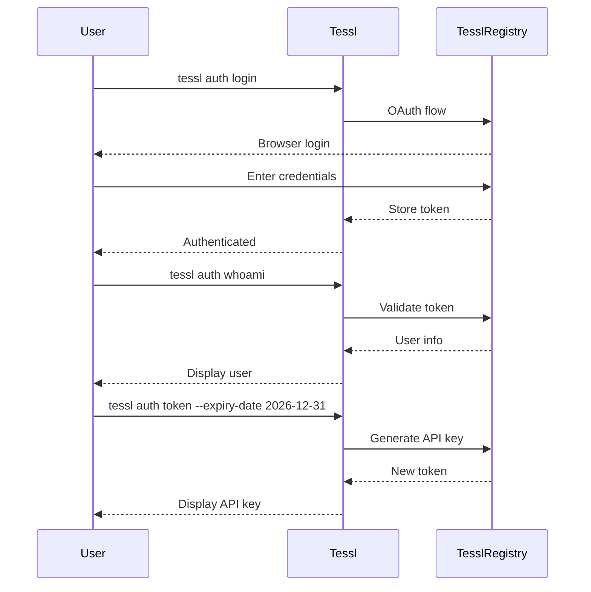

| Command | Description |
|---------|-------------|
| `login` | Authenticate with Tessl via OAuth |
| `logout` | Clear stored credentials |
| `whoami` | Display current user |
| `token` | Generate API key with optional expiry |

### 2. Project Setup (`tessl init`)

Initializes a project for Tessl integration.

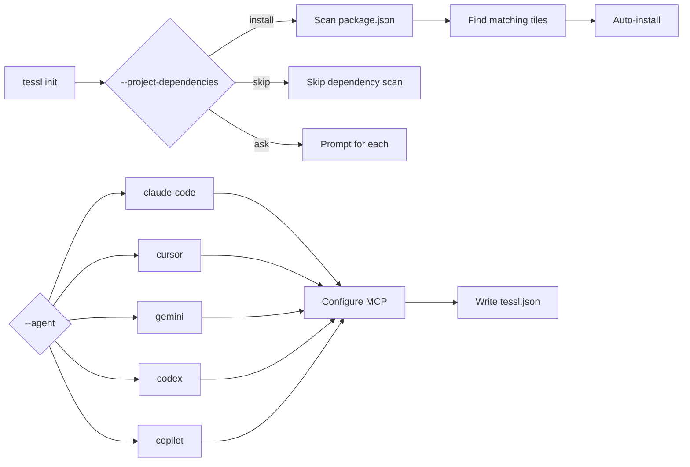

Options:
- `--project-dependencies` - Scan and install matching tiles
- `--agent` - Configure MCP for specific agents

### 3. Registry Operations

#### Search (`tessl search`)

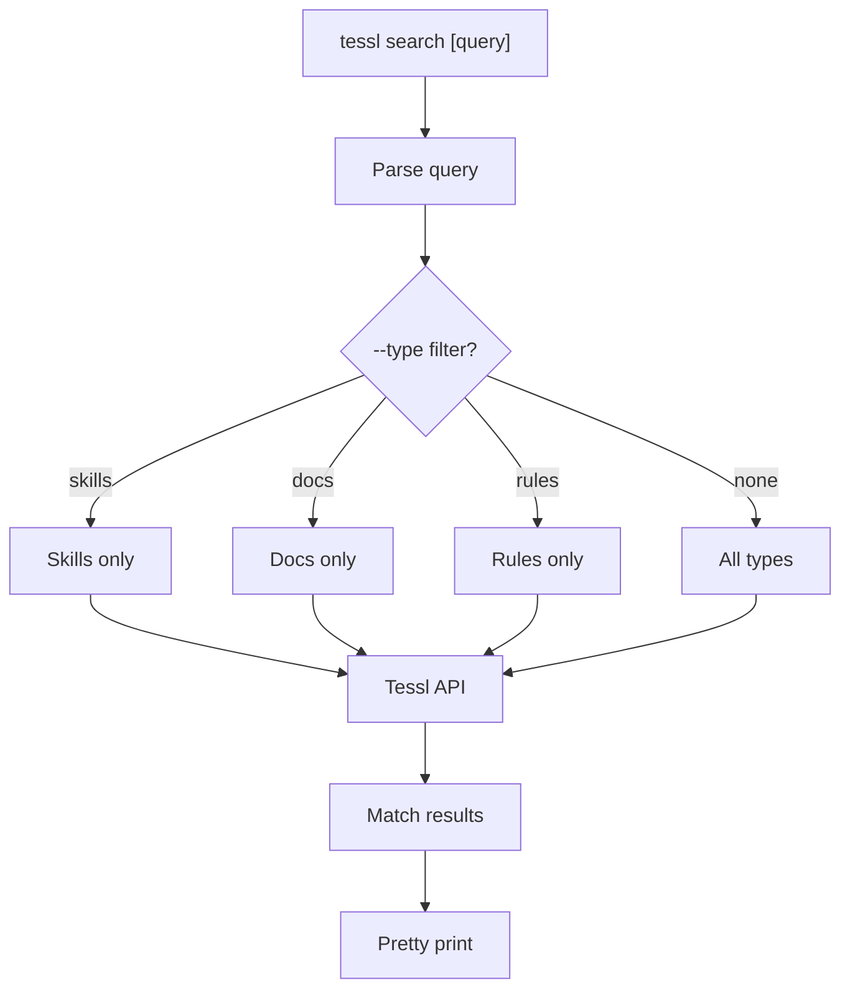

#### Install (`tessl install`)

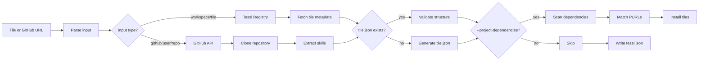

#### Uninstall (`tessl uninstall`)

Removes tiles from `tessl.json` and deletes files.

### 4. Tile Operations (`tessl tile`)

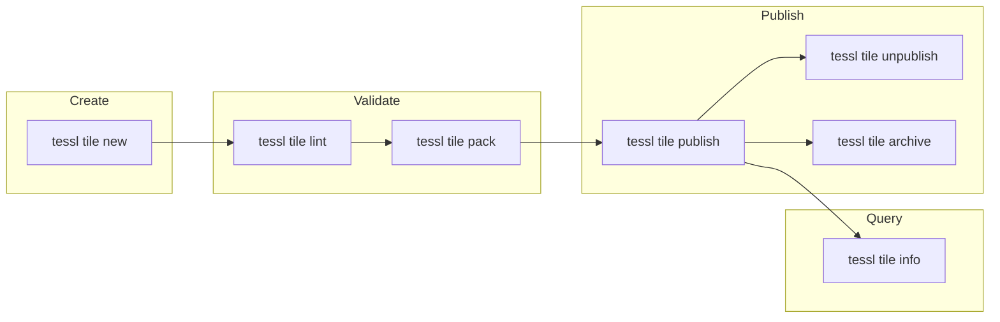

| Command | Description |
|---------|-------------|
| `tile new` | Scaffold new tile with optional docs/rules/skills |
| `tile lint` | Validate tile structure |
| `tile pack` | Package into `.tgz` file |
| `tile publish` | Publish to registry (supports `--skip-evals`) |
| `tile unpublish` | Unpublish within 2-hour window |
| `tile archive` | Archive with reason |
| `tile info` | Show registry details |

### 5. Skill Operations (`tessl skill`)

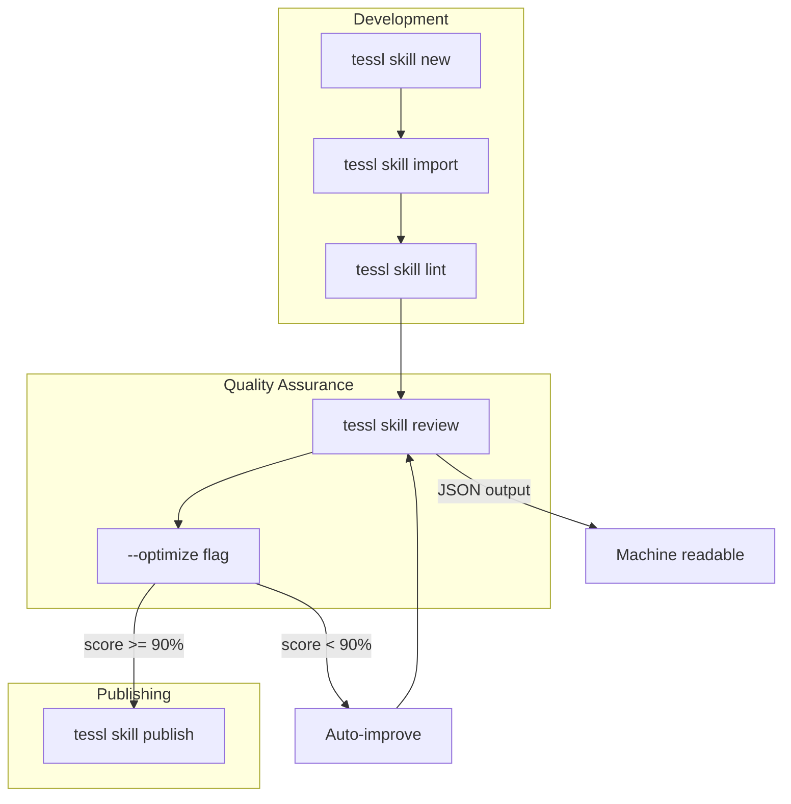

#### Skill Review Process

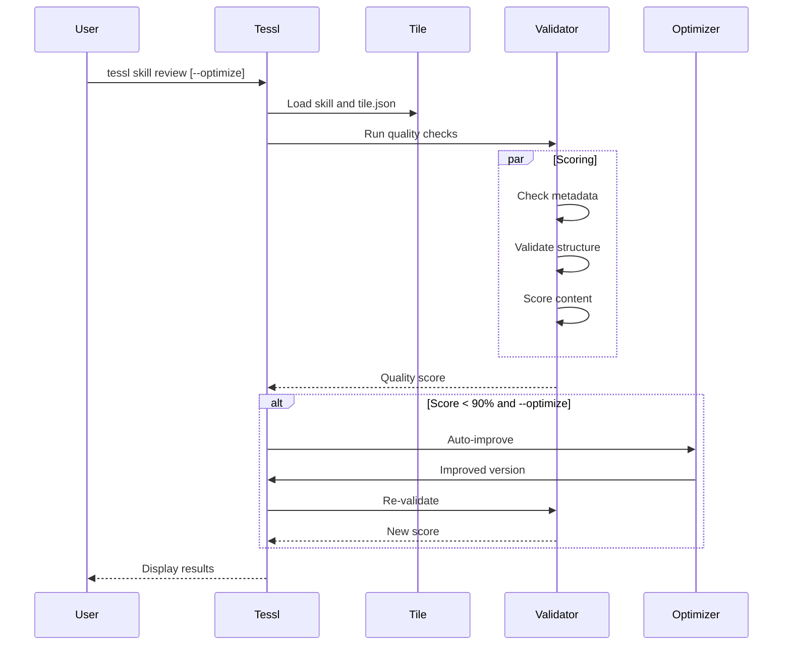

| Command | Description |
|---------|-------------|
| `skill new` | Create standalone skill |
| `skill import` | Create tile.json from SKILL.md |
| `skill lint` | Validate skill structure |
| `skill publish` | Import if needed, then publish |
| `skill review` | Quality assessment with `--optimize` |

### 6. Evaluation (`tessl eval`)

Tests tile effectiveness through structured scenarios.

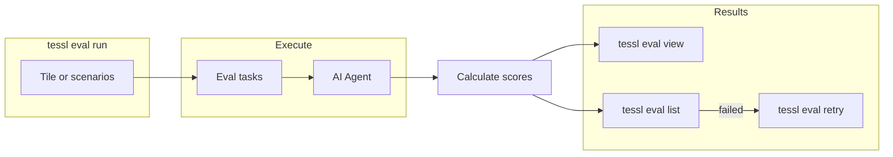

| Command | Description |
|---------|-------------|
| `eval run` | Execute eval scenarios |
| `eval view` | Display eval results |
| `eval list` | List recent runs |
| `eval retry` | Re-run failed evals |

### 7. Workspace Management (`tessl workspace`)

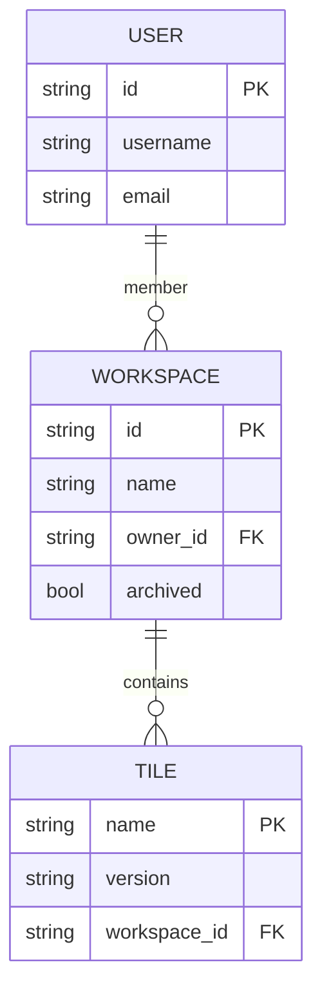

| Command | Description |
|---------|-------------|
| `workspace create` | Create new workspace |
| `workspace list` | List accessible workspaces |
| `workspace delete` | Delete workspace |
| `workspace add-member` | Invite user with role |
| `workspace remove-member` | Remove user |
| `workspace list-members` | Show members |
| `workspace archive` | Archive with reason |
| `workspace unarchive` | Restore workspace |

### 8. Configuration (`tessl config`)

Manages CLI configuration with hierarchical storage:
- Global: `~/.config/tessl/config.json`
- Project: `./tessl.json`

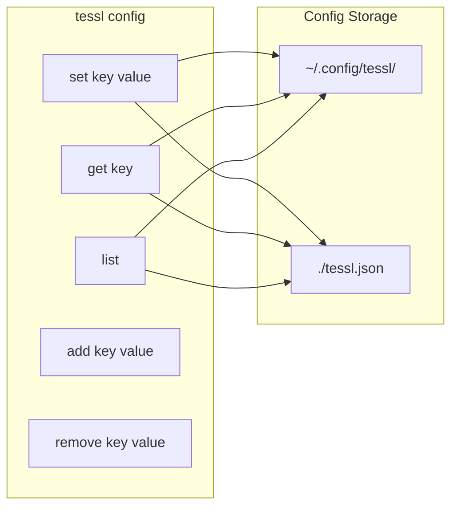

### 9. MCP Server (`tessl mcp`)

Starts the Model Context Protocol server for agent integration.

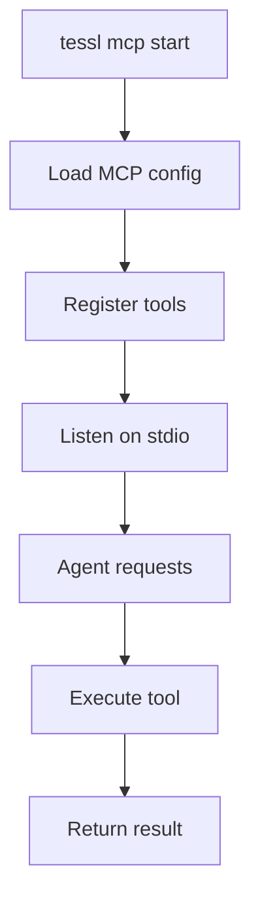

### 10. CLI Self-Management

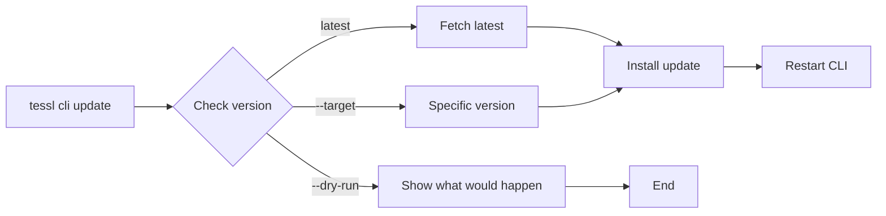

## Data Flow Architecture

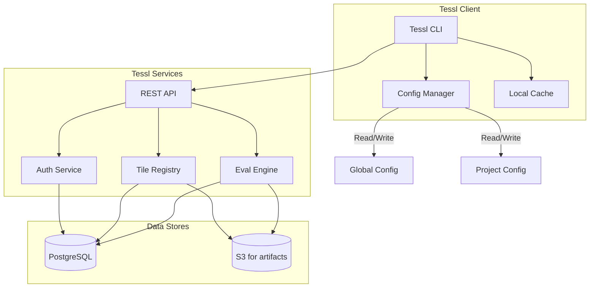

## Tile Lifecycle

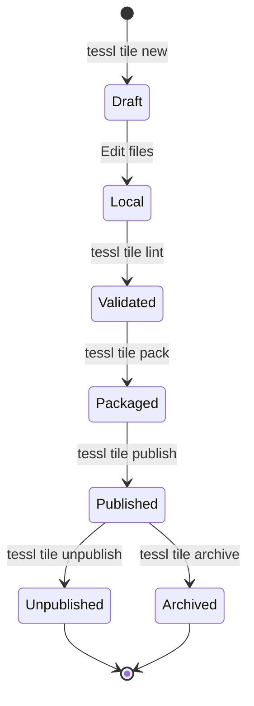

## Skill Review Quality Gates

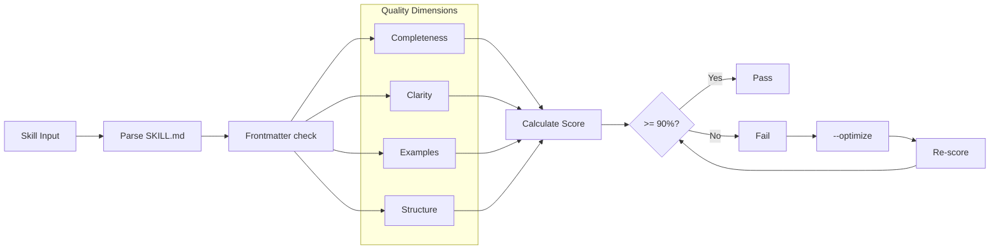

## Installation Flow

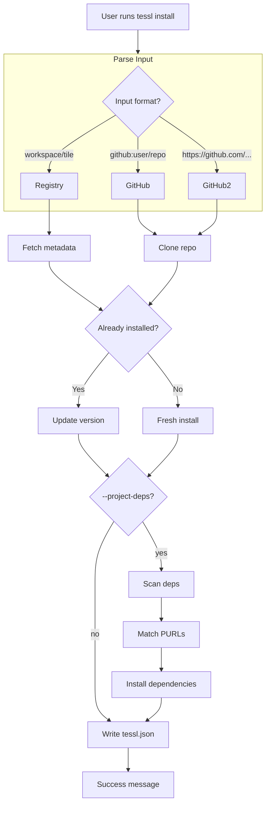

## File Structure

```
project/
├── tessl.json           # Project manifest
├── skills/              # Installed skills
│   └── skill-name/
│       ├── SKILL.md
│       ├── AGENTS.md
│       ├── references/
│       ├── templates/
│       ├── schemas/
│       └── scripts/
└── .tessl/              # Cache
    └── cache.json
```

## Configuration Files

### tessl.json (Project)

```json
{
  "version": "1",
  "dependencies": {
    "workspace/tile": "^1.0.0"
  }
}
```

### tile.json (Tile)

```json
{
  "name": "workspace/tile-name",
  "version": "1.0.0",
  "skills": ["skill-name"],
  "private": false
}
```

## Key Flags and Options

| Global Flag | Description |
|-------------|-------------|
| `--help` | Show help |
| `--version` | Show version |

| Command | Key Flags |
|---------|-----------|
| `install` | `--project-dependencies`, `--yes`, `--skill` |
| `tile publish` | `--skip-evals` |
| `skill review` | `--json`, `--optimize`, `--max-iterations`, `--yes` |
| `eval run` | `--force`, `--agent`, `--workspace`, `--json` |
| `cli update` | `--target`, `--dry-run` |

## Summary

Tessl provides a complete ecosystem for managing AI agent skills:

1. **Discovery** - Search and browse the registry
2. **Installation** - Install tiles from registry or GitHub
3. **Development** - Create and validate skills/tiles locally
4. **Publishing** - Share with the community (public) or organization (private)
5. **Quality** - Review and optimize skill quality
6. **Evaluation** - Test skills against defined scenarios
7. **Integration** - Connect with coding agents via MCP

The CLI follows a clean command-group pattern with consistent subcommands (new, list, delete) across different resource types (tiles, skills, workspaces), making it intuitive for developers familiar with modern CLI tools like npm, cargo, or kubectl.

---

---

## Appendix: How `tessl skill review` Works

This section documents the internal workings of the `tessl skill review` command based on binary inspection.

## Architecture Overview

The `@tessl/cli` npm package is a **bootstrapper** that downloads and executes a compiled Rust binary. The actual CLI logic resides in the binary at `~/.local/share/tessl/versions/tessl-{version}-{platform}`.

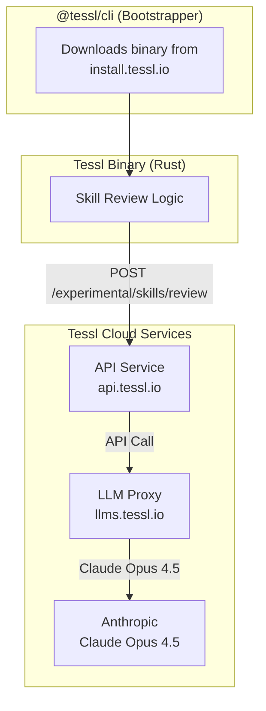

## Network Flow

When you run `tessl skill review [--optimize]`:

```mermaid
sequenceDiagram
    participant User
    participant CLI as Tessl CLI
    participant API as Tessl API<br/>api.tessl.io
    participant LLM as LLM Proxy<br/>llms.tessl.io
    participant Anthropic as Anthropic<br/>Claude Opus 4.5
    
    User->>CLI: tessl skill review [--optimize]
    CLI->>CLI: Load skill content from SKILL.md
    
    alt Not authenticated
        CLI-->>User: Error - run tessl login first
    end
    
    CLI->>API: POST /experimental/skills/review<br/>{content, model: "openai/gpt-4.1"}
    
    Note over API: Server overrides model to<br/>anthropic/claude-opus-4-5
    
    API->>LLM: Forward to LLM service
    LLM->>Anthropic: Call Claude Opus 4.5
    Anthropic-->>LLM: LLM Response
    LLM-->>API: Processed response
    API-->>CLI: {validation, descriptionJudge, contentJudge}
    
    CLI->>User: Display scores and suggestions
```

## Key Findings

### 1. NOT a Local Model

The skill review does **NOT** run a local model. It makes API calls to Tessl's cloud infrastructure.

### 2. Requires Authentication

- Must run `tessl login` before using `skill review`
- The login provides an access token that's used for API calls
- The LLM API key is also obtained during login

### 3. Default LLM Configuration

- **CLI Default Model**: OpenAI GPT-4.1 (`openai/gpt-4.1`)
- **Actual Server Model**: Anthropic Claude Opus 4.5 (`anthropic/claude-opus-4-5`)
- **LLM Base URL**: `https://llms.tessl.io`
- **API Base URL**: `https://api.tessl.io`

The CLI default model is confirmed from direct binary inspection:

```rust
// Extracted from tessl binary (line ~84 of LLM client code)
let Z = D.model ?? "openai/gpt-4.1"
```

This shows GPT-4.1 is the hardcoded default when no model is specified via the `--model` flag. However, the Tessl API server **overrides this** and uses Claude Opus 4.5 for the actual LLM judging.

### 4. The Prompt is Server-Side

The actual LLM prompt used for skill review/improvement is **not in the CLI binary** - it's constructed on Tessl's API server side. This is an important architectural detail:

```mermaid
flowchart LR
    subgraph CLI["Tessl CLI (Local)"]
        C1[Read SKILL.md]
        C2[Send JSON body]
    end
    
    subgraph API["Tessl API (Remote)"]
        A1[Receive content]
        A2[Construct prompt]
        A3[Call LLM]
    end
    
    C1 --> C2
    C2 --> A1
    A1 --> A2
    A2 --> A3
```

**What the CLI sends to the API:**

The CLI sends a JSON payload with the skill content. There are two endpoints:

**1. `/experimental/skills/review`** (basic validation):
```json
{
  "content": "<entire SKILL.md content>",
  "model": "openai/gpt-4.1"
}
```

**2. `/experimental/skills/improve`** (with `--optimize` flag):
```json
{
  "content": "<entire SKILL.md content>",
  "model": "openai/gpt-4.1",
  "max-iterations": 3
}
```

The payload is indeed **just the raw skill content** - no additional context, metadata, or prompt is included in the request from the CLI side. The prompt construction happens at `api.tessl.io` - not locally. This means:
- The prompt itself is proprietary to Tessl
- It can be updated without CLI changes
- It's not directly inspectable from the binary

### 4. API Endpoint

- **Path**: `/experimental/skills/improve`
- **Method**: POST
- **Requires Auth**: Yes

### 5. Request/Response Format

**Request Body**:
```json
{
  "content": "SKILL.md content...",
  "model": "openai/gpt-4.1",
  "max-iterations": 3
}
```

**Response**:
```json
{
  "diff": "```diff\n...",
  "improvedContent": "...",
  "originalContent": "...",
  "originalScore": 75,
  "finalScore": 92,
  "summaryOfChanges": "..."
}
```

## Environment Variables

| Variable | Default | Purpose |
|----------|---------|---------|
| `TESSL_API_BASE_URL` | `https://api.tessl.io` | Main API endpoint |
| `TESSL_LLM_BASE_URL` | `https://llms.tessl.io` | LLM proxy service |
| `TESSL_LLM_API_KEY` | (from login) | API key for LLM calls |
| `TESSL_LLM_MODEL_PREFIX` | `evals-` (when localhost) | Model prefix for local dev |

## Error Handling

The CLI provides helpful error messages for common issues:

- **404 on LLM**: Check `TESSL_LLM_BASE_URL` (should be `https://llms.tessl.io`)
- **401/403**: Authentication failed - run `tessl login`
- **No LLM API key**: Run `tessl login` to obtain credentials

## Score Calculation

The quality score is calculated by the LLM based on:
- Skill completeness
- Clarity of instructions
- Quality of examples
- Proper structure (frontmatter, sections)
- Compliance with Tessl specifications

## Can the Prompt Be Extracted?

### The Honest Answer

Based on binary analysis, the API response schema does **NOT** include the prompt itself:

```json
{
  "diff": "```diff\n...",
  "improvedContent": "...",
  "originalContent": "...",
  "originalScore": 75,
  "finalScore": 92,
  "summaryOfChanges": "..."
}
```

There's no field for "prompt", "systemMessage", or "llmInput" in the response structure.

### Live API Test Results

We tested the API directly. Here's what the `/experimental/skills/review` endpoint actually returns:

```json
{
  "validation": {
    "checks": [
      {"name": "skill_md_line_count", "status": "passed", ...},
      {"name": "frontmatter_valid", "status": "passed", ...},
      {"name": "name_field", "status": "passed", ...},
      {"name": "description_field", "status": "warning", ...},
      ...
    ],
    "overallPassed": true,
    "errorCount": 0,
    "warningCount": 1
  },
  "descriptionJudge": {
    "judgeConfig": {
      "model": "anthropic/claude-opus-4-5"
    },
    "evaluation": {
      "scores": {
        "specificity": {"score": 1, "reasoning": "..."},
        "trigger_term_quality": {"score": 1, "reasoning": "..."},
        "completeness": {"score": 1, "reasoning": "..."},
        "distinctiveness_conflict_risk": {"score": 1, "reasoning": "..."}
      },
      "overall_assessment": "...",
      "suggestions": ["...", "..."]
    },
    "weightedScore": 1,
    "normalizedScore": 0
  },
  "contentJudge": {
    "judgeConfig": {
      "model": "anthropic/claude-opus-4-5"
    },
    "evaluation": {
      "scores": {
        "conciseness": {"score": 2, "reasoning": "..."},
        "actionability": {"score": 1, "reasoning": "..."},
        "workflow_clarity": {"score": 1, "reasoning": "..."},
        "progressive_disclosure": {"score": 1, "reasoning": "..."}
      },
      "overall_assessment": "...",
      "suggestions": ["...", "..."]
    },
    "weightedScore": 1.3,
    "normalizedScore": 0.15
  }
}
```

### Key Findings from Live Test

1. **NOT-4.1 for GPT review!** The actual models used are:
   - `anthropic/claude-opus-4-5` for descriptionJudge
   - `anthropic/claude-opus-4-5` for contentJudge

2. **Two separate judges** evaluate the skill:
   - **descriptionJudge** - evaluates the frontmatter `description` field
   - **contentJudge** - evaluates the SKILL.md body content

3. **Scoring dimensions**:
   - **descriptionJudge**: specificity, trigger_term_quality, completeness, distinctiveness_conflict_risk
   - **contentJudge**: conciseness, actionability, workflow_clarity, progressive_disclosure

4. **No prompt leaked** - the response only contains scores, reasoning, and suggestions - not the actual prompt used

### How to Verify

#### Option 1: Run a test (Bun/TypeScript)

```bash
bun scripts/test-tessl-api.ts
```

See `scripts/test-tessl-api.ts` for a working example.

#### Option 2: Network Proxy

```bash
# Start a proxy
mitmproxy -p 8080

# Route Tessl through it
TESSL_HTTP_PROXY=http://localhost:8080 tessl skill review skills/dummy
```

Note: Tessl may have certificate pinning, so this might fail.

### Conclusion

The prompt itself lives exclusively on Tessl's server side. It's not leaked in:
- The CLI binary (we checked)
- The API request payload (just raw content)
- The API response (just diff/results)

However, the response DOES reveal:
- The model used (Claude Opus 4.5, NOT GPT-4.1!)
- Detailed scoring criteria
- Reasoning behind each score
- Improvement suggestions

To see what actually goes to the LLM, you'd need access to Tessl's server-side infrastructure or documentation.
