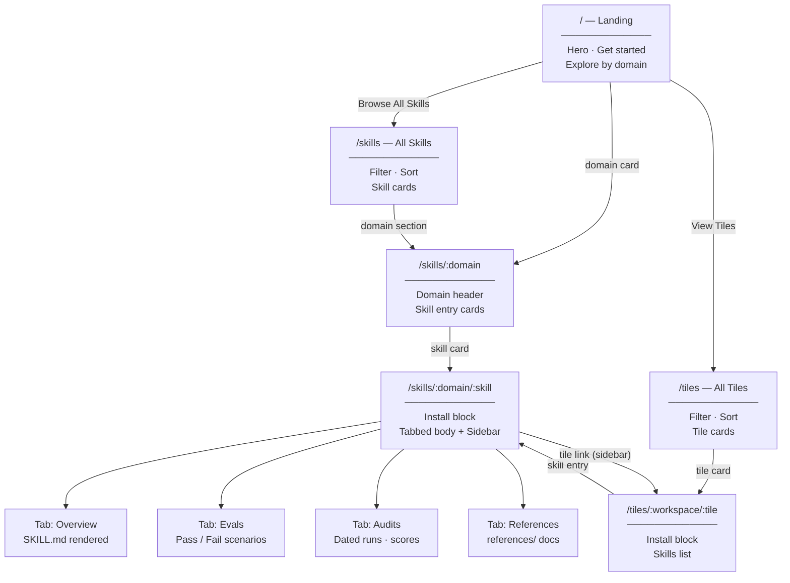

# Website Hierarchy

Derived from the six preview files in `.context/previews/` and the `skills/` directory structure.

---

## Site Map

```
/                              Landing page
├── /tiles                     All tiles (listing)
│   └── /:workspace/:tile      Tile detail
│           └── /:skill        → redirects to /skills/:domain/:skill
└── /skills                    All skills (listing)
    └── /:domain               Domain listing
        └── /:skill            Skill detail
```



---

## Pages

### `/` — Landing

**Sections (top to bottom)**

| # | Section | Content |
|---|---------|---------|
| 1 | Top nav | Logo → `/`, links: Skills, Tiles · search kbd · GitHub button |
| 2 | Hero | Eyebrow ("Open Source · Quality-graded") · headline · sub-copy · CTA buttons (Browse All Skills, View Tiles) |
| 3 | Get started | Terminal snippet: `bunx skills add ./skills --all` / single-skill variant |
| 4 | Explore by domain | Grid of domain cards (icon · name · skill count), each links to `/skills/:domain` |

---

### `/tiles` — All Tiles

**Layout** — top nav + left nav + main content

**Left nav sections**

- All Skills → `/skills`
- All Tiles → `/tiles` *(active)*
- Domain sections (each with tile sub-items)

**Main content**

| Element | Detail |
|---------|--------|
| Breadcrumb | tekhne > Tiles |
| Page header | "Tiles" · description · stats pill (N skills · N domains) |
| Toolbar | Text filter input · sort buttons (Name, Skills) |
| Tile card grid | Each card: version badge · public/private badge · domain tag · title · description · skill count |

---

### `/tiles/:workspace/:tile` — Tile Detail

**Layout** — top nav + left nav (domain tree with skill sub-items) + main content

**Main content**

| Element | Detail |
|---------|--------|
| Breadcrumb | tekhne > Tiles > workspace/tile-name |
| Tile header | Name · version · public/private · skill count pill · summary |
| Install block | Package manager tabs (bun · npm · pnpm · yarn · agent-skills) · install command per PM |
| Skills section | Heading "Skills in this tile" · skill entry cards (name · grade badge · description → links to `/skills/:domain/:skill`) |

---

### `/skills` — All Skills

**Layout** — top nav + left nav + main content

**Left nav sections**

- All Skills → `/skills` *(active)*
- All Tiles → `/tiles`
- Domain sections (collapsible, each with skill sub-items + count badge)

**Main content**

| Element | Detail |
|---------|--------|
| Breadcrumb | tekhne > Skills |
| Page header | "Skills" · description · stats (N skills · N domains) |
| Toolbar | Text filter · sort buttons (Name, Grade) |
| Skill card grid | Name · grade badge · domain tag · description |

---

### `/skills/:domain` — Domain Listing

**Layout** — top nav + left nav (domain item active, skill sub-items visible) + main content

**Main content**

| Element | Detail |
|---------|--------|
| Breadcrumb | tekhne > Skills > domain |
| Domain header | Domain name · icon · skill count · description |
| Toolbar | Text filter · sort buttons (Name, Grade) · PM selector dropdown |
| Skill entry cards | Name · grade badge · trigger description (one-liner) |

---

### `/skills/:domain/:skill` — Skill Detail

**Layout** — top nav + left nav (skill item active) + main content + sidebar

**Main content — header**

| Element | Detail |
|---------|--------|
| Breadcrumb | tekhne > Skills > domain > skill-name |
| Skill header | Name · grade badge (A/B/C letter) · tag badges (domain, tile name, version) |
| Install block | PM tabs · install command |

**Main content — tabbed body**

| Tab | Content |
|-----|---------|
| **Overview** | Rendered `SKILL.md` (full Markdown) |
| **Evals** | Summary stats row (total · pass · fail) · eval list rows (pass/fail status pill · scenario title · description) |
| **Audits** | Date selector sidebar (list of dated audit runs) · audit cards (date · model · grade · per-dimension scores · total · improvement notes) |
| **References** | List of reference documents from `references/` (rendered Markdown or linked) |

**Sidebar** (sticky, right of content)

| Element | Detail |
|---------|--------|
| Grade pill | Letter grade + numeric score (e.g. A · 132/140) |
| Tile | Link to parent tile (`/tiles/:workspace/:tile`) |
| Version | Tile semver |
| Domain | Link to domain listing |
| Install snippet | Quick-copy install command |

---

## Data Sources → Pages

| Source path | Consumed by |
|-------------|-------------|
| `skills/:domain/:skill/tile.json` | `/tiles`, `/tiles/:w/:t` |
| `skills/:domain/:skill/SKILL.md` | `/skills/:d/:s` Overview tab |
| `skills/:domain/:skill/evals/` | `/skills/:d/:s` Evals tab |
| `.context/audits/:domain/:skill/:date/audit.json` | `/skills/:d/:s` Audits tab |
| `skills/:domain/:skill/references/` | `/skills/:d/:s` References tab |

---

## Grade Scale (audit badge colours)

| Grade | Score | Colour |
|-------|-------|--------|
| A+ / A | ≥ 126/140 | Green |
| B+ | 119–125 | Yellow |
| B | 112–118 | Amber |
| C+ / C | < 112 | Orange/Red |
