# pantheon-journal

Create and validate structured journal entries. This crate also bundles the
`documentation/journal-entry-creator` skill and can install it into any
supported agent's skills directory.

## Updating the bundled skill

The skill is **not** vendored into this crate. `build.rs` embeds it straight
from the canonical tree at
[`skills/documentation/journal-entry-creator/`](../../skills/documentation/journal-entry-creator/)
at compile time, via `include_bytes!`. Edit the skill there; this crate has no
copy to keep in sync.

```mermaid
flowchart LR
    subgraph edit["1. Edit"]
        A["skills/documentation/journal-entry-creator/**"]
    end

    subgraph build["2. Build (automatic)"]
        B["build.rs walks the skill tree<br/>emits cargo:rerun-if-changed per file + root dir"]
        C["OUT_DIR/embedded_skill.rs<br/>(path, bytes) table via include_bytes!"]
        B --> C
    end

    subgraph release["3. Release (manual)"]
        D["Bump version in Cargo.toml"]
        E["Push tag tool/pantheon-journal-vX.Y.Z"]
        F[".github/workflows/tool-release.yml<br/>(cargo-dist)"]
        D --> E --> F
    end

    subgraph install["4. Install (user)"]
        G["pantheon-journal skill install"]
        H["skill_bundle::materialise()<br/>writes embedded bytes to disk"]
        I["copied/symlinked into the<br/>target agent's skills directory"]
        G --> H --> I
    end

    A -->|any file changes,<br/>next cargo build| B
    C -->|baked into the binary| D
    F -->|published binary| G
```

Steps in full:

1. **Edit** the skill's `SKILL.md`, `references/`, `scripts/`, or `templates/`
   under `skills/documentation/journal-entry-creator/`. There is nothing to
   edit inside `crates/journal/`.
2. **Build**: the next `cargo build` picks the change up automatically.
   `build.rs` emits `cargo:rerun-if-changed` for every embedded file and for
   the skill root directory itself, so added/removed files also trigger a
   rebuild. No manual re-embed step exists.
3. **Release**: bump the version in [`Cargo.toml`](Cargo.toml), then push a
   tag matching `tool/pantheon-journal-v<semver>` (the `tool/` namespace is
   set in `dist-workspace.toml`). That fires the cargo-dist release workflow,
   which builds and publishes the binaries. There is no CHANGELOG.md and no
   automated version bump for this crate — both steps are manual.
4. **Install**: end users run `pantheon-journal skill install`, which
   materialises the embedded files and copies (or symlinks) them into the
   detected or selected agent's skills directory.

### Version numbers are not synced

Two version numbers exist for this skill, and they are **deliberately not the
same number**:

| Version | Where it lives | What it gates |
| --- | --- | --- |
| Crate version | [`Cargo.toml`](Cargo.toml) `version` | What `pantheon-journal --version` reports and what a release tag bumps |
| Plugin version | `skills/documentation/journal-entry-creator/.tessl-plugin/plugin.json` | Historical Tessl registry metadata; unused for this distribution path |

This skill is excluded from the release-please sync that keeps `plugin.json`
versions current for registry-published skills, because it ships only via
this crate's own release process, never via `tessl:publish`. Don't try to
reconcile the two numbers — treat the crate version as authoritative for
anyone installing via `pantheon-journal skill install`.

## Other commands

Run `pantheon-journal --help` for the full command list (`new`, `lint`,
`index`, `backfill`, `skill install`, `skill uninstall`).
