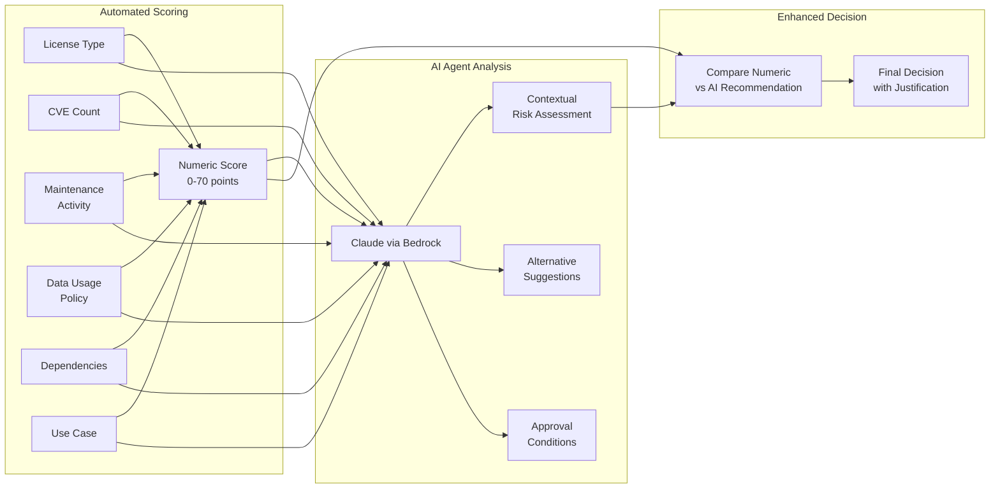
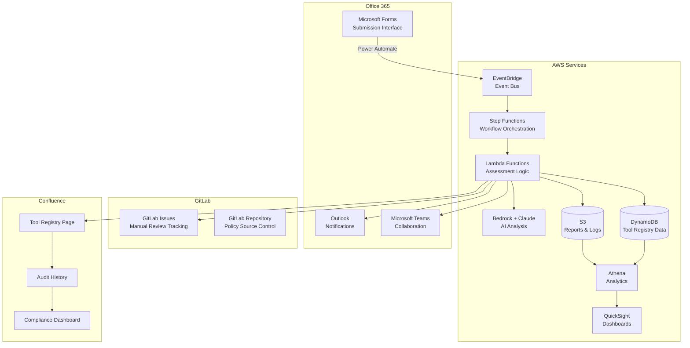
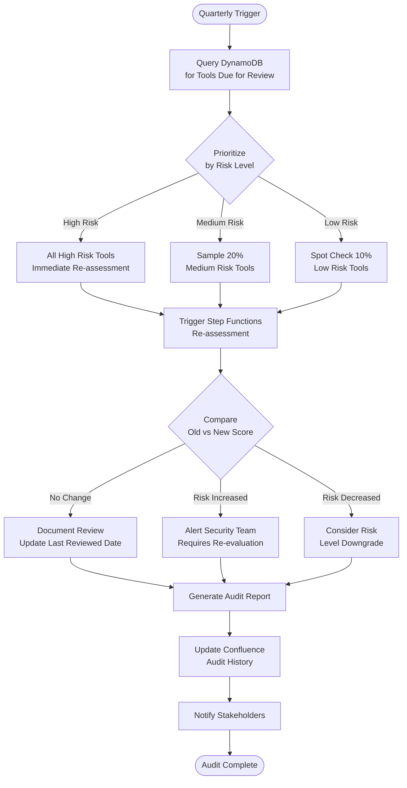

<!-- markdownlint-disable MD025 -->

# FOSS Enterprise Evaluation Process - November 11, 2025

## Session Overview

This document defines a comprehensive Free and Open Source Software (FOSS) evaluation process for enterprise adoption. The system integrates Office 365 (forms and notifications), GitLab (issue
tracking), AWS (automation and AI analysis), and Confluence (tool registry and audit tracking) to provide automated vetting, approval workflows, and continuous compliance monitoring.

**Created:** November 11, 2025  
**Purpose:** Design automated FOSS evaluation system with dual-track approval and AI-powered decision support  
**Scope:** Process diagrams, system architecture, integration patterns, and audit workflows  
**Key Innovation:** AI agent (Claude via AWS Bedrock) provides contextual analysis beyond numeric scoring

## Executive Summary

This FOSS evaluation process provides:

✅ **Fast approval path** for low-risk tools (< 5 minutes automated)  
✅ **AI-powered decision support** using Claude for contextual risk analysis  
✅ **Clear routing** to procurement for high-risk tools  
✅ **Complete audit trail** in Confluence with quarterly/yearly reviews  
✅ **Integration** across Office 365, GitLab, AWS, and Confluence

**Key Objectives:**

1. **Direct Approval Path**: Pre-approved tools bypass procurement for rapid adoption
2. **AI-Enhanced Analysis**: Claude agent provides contextual intelligence beyond numeric scores
3. **Procurement Routing**: High-risk tools automatically routed to formal procurement
4. **Audit Trail**: Complete tracking in Confluence registry with quarterly/yearly reviews
5. **Integration**: Seamless workflow across Office 365, AWS, GitLab, and Confluence

## System Architecture

### High-Level Process Flow

```mermaid
flowchart TD
    Start([Tool Request Initiated]) --> Form[Office 365 Form<br/>Tool Submission]
    Form --> EventBridge[AWS EventBridge<br/>Event Processing]

    EventBridge --> StepFunctions[Step Functions<br/>Orchestration]

    StepFunctions --> Parallel[Parallel Assessment]
    Parallel --> License[License Check]
    Parallel --> CVE[CVE Scan]
    Parallel --> Maintenance[Maintenance Check]

    License --> RiskCalc[Risk Score<br/>Calculation]
    CVE --> RiskCalc
    Maintenance --> RiskCalc

    RiskCalc --> AIAgent[Claude AI Agent<br/>Contextual Analysis]

    AIAgent --> Decision{Enhanced<br/>Decision}

    Decision -->|Low Risk<br/>Score ≤ 15| DirectApprove[Auto-Approve]
    Decision -->|Medium Risk<br/>16-25| Review[Security Review Required]
    Decision -->|High Risk<br/>Score > 25| Procurement[Full Procurement Process]
    Decision -->|AI Override| Review

    DirectApprove --> Registry[Update Confluence Registry]
    Review --> ReviewDecision{Manual<br/>Review}
    ReviewDecision -->|Approved| Registry
    ReviewDecision -->|Rejected| Reject[Rejection with Rationale]
    ReviewDecision -->|Needs Mitigation| Procurement

    Procurement --> ProcDecision{Procurement<br/>Outcome}
    ProcDecision -->|Approved| Registry
    ProcDecision -->|Rejected| Reject

    Registry --> Notify[Send Notification<br/>via Email]
    Reject --> Notify

    Notify --> End([End])

    Registry -.-> Audit[Quarterly/Yearly<br/>Audit Process]
    Audit -.-> Registry
```

### Risk Scoring Engine with AI Enhancement

### System Integration Architecture

## AI Agent Integration: Claude for Decision Support

### Why AI Agent is Critical

**Problem with Pure Numeric Scoring:**

- Tool scores 4/70 → Auto-approved
- BUT: Used for processing customer PII in web forms
- Numeric score misses contextual data handling risks

**AI Agent Solution:**

- Analyzes the specific use case context
- Identifies data exposure risks (browser dev tools, virtual DOM)
- Recommends security review despite low numeric score
- Provides specific mitigation conditions

### What Claude Analyzes

#### 1. Contextual Risk Assessment

- CVE severity **in context** of usage pattern
- License compatibility with **specific use case**
- Maintenance patterns (not just commit frequency)
- Community health from issue discussions

#### 2. Natural Language Analysis

- Reads and summarizes privacy policies
- Analyzes Terms of Service for problematic clauses
- Reviews documentation quality
- Evaluates community health signals

#### 3. Comparative Analysis

- Compares against similar approved tools
- Identifies patterns from historical assessments
- Suggests alternatives with better risk profiles
- Learns from past approval decisions

#### 4. Decision Justification

- Generates human-readable rationale
- Explains why a tool scored the way it did
- Provides specific remediation recommendations
- Identifies aspects requiring human expert review

### Example AI Agent Output

**Scenario:** React framework requested for customer PII form builder

**Numeric Score:** 4/70 (LOW RISK - would auto-approve)

**AI Agent Analysis:**

- **Override Decision:** REVIEW_REQUIRED
- **Confidence:** High
- **Key Concern:** "Customer PII exposure in React DevTools and virtual DOM memory retention"
- **Recommendation:** "Escalate to security review despite low technical risk score due to data sensitivity context"

**Approval Conditions Generated:**

1. React DevTools must be completely disabled in production
2. All PII form fields must use encrypted state management
3. Browser storage must not contain PII
4. Implementation requires architecture review of form data flow

**Human Review Focus:**

- Architecture review of PII handling patterns
- Verification of DevTools disablement in production build
- Compliance team review of client-side processing model

**Justification:**

> "React has excellent technical health (MIT license, active maintenance, no CVEs), earning a low risk score of 4/70. However, the specific use case of handling customer PII in browser-based forms
> introduces contextual risks that numeric scoring cannot capture. The virtual DOM architecture and dev tools ecosystem create potential data leakage vectors when handling sensitive information. This
> requires architectural review and specific security controls before approval."

### AI Agent Value Proposition

| Capability                | Without AI Agent             | With AI Agent (Claude)                         |
| ------------------------- | ---------------------------- | ---------------------------------------------- |
| **Context Awareness**     | Only numeric metrics         | Understands use case implications              |
| **Policy Reading**        | Manual human review required | Automated privacy policy analysis              |
| **Alternative Discovery** | Manual research              | AI suggests better alternatives with tradeoffs |
| **Decision Quality**      | False positives/negatives    | Contextually appropriate decisions             |
| **Review Guidance**       | Generic checklist            | Specific questions for human reviewers         |
| **Learning**              | Static rules                 | Learns from historical decisions               |
| **Review Time**           | 20+ minutes per tool         | 5 minutes (AI pre-analysis)                    |

## Data Flow & Integration Points

### 1. Request Submission (Office 365 → AWS)

**User Action:** Submits Microsoft Form  
**Power Automate:** Captures form data  
**EventBridge:** Receives event via webhook  
**Step Functions:** Initiates assessment workflow

### 2. Automated Assessment (AWS Lambda + External APIs)

**License Check:** Queries SPDX license database  
**CVE Scan:** Queries NVD/GitHub Security Advisories  
**Maintenance Check:** Queries GitHub API for activity metrics  
**Risk Calculation:** Combines scores (0-70 scale)

### 3. AI Analysis (AWS Bedrock + Claude)

**Input:** Complete assessment data + use case context  
**Processing:** Claude 3.5 Sonnet analyzes with 4K token response  
**Output:** Structured JSON with recommendation, concerns, conditions, alternatives

### 4. Decision Routing

**Auto-Approve (≤15):** Direct to registry update  
**Review Required (16-25):** Create GitLab issue, assign security team  
**Procurement (>25):** Route to procurement workflow  
**AI Override:** Escalate/de-escalate based on context

### 5. Registry Update (Confluence)

**DynamoDB:** Store structured assessment data  
**Confluence API:** Update registry page with tool entry  
**S3:** Store detailed assessment report  
**GitLab:** Create issue for manual reviews

### 6. Notification (Email/Teams)

**SQS Queue:** Ensures reliable notification delivery  
**Outlook:** Sends approval/rejection email  
**Teams:** Posts to FOSS Evaluation channel

## Confluence Registry Structure

### Registry Page Sections

#### 1. Quick Stats Dashboard

- Total tools: 62
- ✅ Approved: 45
- ⚠️ Conditional: 12
- ❌ Rejected: 8
- 🔍 Under Review: 5

#### 2. Approved Tools Table

| Tool Name  | Version | License    | Risk Score | Last Reviewed | Restrictions     | AI Analysis      |
| ---------- | ------- | ---------- | ---------- | ------------- | ---------------- | ---------------- |
| React      | 18.2.0  | MIT        | 4          | 2025-11-01    | PII restrictions | Link in registry |
| Vue.js     | 3.3.4   | MIT        | 5          | 2025-10-15    | None             | Link in registry |
| Ollama     | 0.1.14  | MIT        | 8          | 2025-11-05    | Self-hosted only | Link in registry |
| TypeScript | 5.2.2   | Apache 2.0 | 2          | 2025-11-01    | None             | Link in registry |

#### 3. Tool Detail Pages

Each tool has a dedicated page with:

- Risk breakdown by category
- AI agent analysis summary
- Key concerns and mitigations
- Approval conditions
- Usage guidelines (approved/prohibited use cases)
- Licensing details
- Security information
- Audit history

## Quarterly Audit Process

### Automated Quarterly Audit Workflow

### Audit Schedule by Risk Level

**High Risk (score > 25):** Quarterly  
**Medium Risk (16-25):** Bi-annually  
**Low Risk (≤ 15):** Annually

### Audit Metrics Tracked

- Tools reviewed this period
- Risk score changes (improved/degraded/stable)
- New CVEs discovered
- License changes detected
- Maintenance status changes
- Actions required

## Cost Analysis

### Monthly AWS Cost Estimate

| Service              | Usage                          | Cost/Month |
| -------------------- | ------------------------------ | ---------- |
| EventBridge          | 1,000 events                   | $1.00      |
| Step Functions       | 1,000 executions (6 steps)     | $0.30      |
| Lambda               | 6,000 invocations, 512MB       | $1.80      |
| **Bedrock (Claude)** | **1,000 requests, ~6K tokens** | **$15.00** |
| DynamoDB             | 10GB storage, 100 WCU, 100 RCU | $7.50      |
| S3                   | 50GB storage, 10K requests     | $1.50      |
| Athena               | 100GB scanned/month            | $5.00      |
| QuickSight           | 1 author, 10 readers           | $28.00     |
| CloudWatch           | Logs, metrics, alarms          | $5.00      |
| SQS                  | 1,000 messages                 | $0.50      |
| **TOTAL**            |                                | **~$65**   |

**Cost per assessment:** $0.065  
**ROI:** Reduces manual review time from 20 min → 5 min per tool  
**Annual savings:** Estimated 250 hours of security team time

## Example Use Cases

### Case 1: Low-Risk Auto-Approval

**Tool:** Prettier (code formatter)  
**Numeric Score:** 1/70  
**AI Analysis:** "Excellent technical health, MIT license, no data handling, minimal dependencies"  
**Decision:** AUTO_APPROVE  
**Time:** < 2 minutes end-to-end

### Case 2: AI Override - Context Escalation

**Tool:** React 18.2.0  
**Numeric Score:** 4/70  
**Use Case:** Customer PII form processing  
**AI Analysis:** "Despite low technical risk, PII handling in browser requires architectural review"  
**Decision:** REVIEW_REQUIRED (AI override)  
**Outcome:** Security team reviews, approves with conditions

### Case 3: High-Risk Procurement Route

**Tool:** Commercial AI service (hypothetical)  
**Numeric Score:** 35/70  
**AI Analysis:** "Proprietary license, trains on user data, no DPA available, no self-hosted option"  
**Decision:** PROCUREMENT_REQUIRED  
**Outcome:** Routed to procurement; enterprise tier with DPA required

### Case 4: License Change Detection (Audit)

**Tool:** Elasticsearch  
**Previous Score:** 12/70 (Approved)  
**Audit Detection:** License changed Apache 2.0 → SSPL  
**New Score:** 28/70  
**AI Analysis:** "SSPL license creates commercial restrictions; immediate review required"  
**Action:** Alert security team, mark for re-evaluation, document restrictions

## Compliance

This FOSS evaluation process ensures compliance with organizational and regulatory requirements:

### Data Protection

- **Form Data:** Minimal PII (requester email only)
- **API Tokens:** Stored in AWS Secrets Manager
- **Confluence Access:** Role-based permissions
- **Audit Logs:** All actions logged in CloudWatch and DynamoDB

### Compliance Alignment

**RFC 98:** Extends evaluation framework with automation  
**GDPR:** No PII beyond requester email; complete audit trail  
**ISO 27001:** Risk assessment, continuous monitoring, change management  
**SOC 2:** Audit logging, access controls, incident response

### Audit Schedule

- **Quarterly:** High-risk tools (score > 25)
- **Bi-annually:** Medium-risk tools (score 16-25)
- **Annually:** Low-risk tools (score ≤ 15)

### Validation

- All tools must pass automated risk assessment before approval
- High-risk tools (score > 25) require formal procurement review
- AI agent provides contextual analysis to catch risks numeric scoring may miss
- Quarterly audits ensure continuous compliance and detect tool changes

## Key Benefits

### 1. Speed

- **Auto-approval:** < 5 minutes for low-risk tools
- **AI pre-analysis:** Reduces manual review from 20 min → 5 min
- **Parallel processing:** Multiple assessments simultaneously

### 2. Quality

- **AI context awareness:** Catches risks numeric scoring misses
- **Consistent decisions:** Same criteria applied to all tools
- **Learning system:** Improves over time from historical data

### 3. Transparency

- **Complete audit trail:** Every decision logged in Confluence
- **Justification:** AI provides detailed reasoning for decisions
- **Reproducible:** Same inputs → same outputs

### 4. Scalability

- **Serverless:** Auto-scales with request volume
- **Pay-per-use:** Only pay for actual assessments
- **Low maintenance:** Minimal operational overhead

### 5. Governance

- **Automated audits:** Quarterly reviews with anomaly detection
- **Compliance tracking:** Dashboard shows compliance status
- **Policy enforcement:** Consistent application of approval criteria

## Next Steps

1. Review this architecture with stakeholders (Security, IT, Procurement, Legal)
2. Obtain budget approval for AWS costs (~$65/month)
3. Provision AWS account and Bedrock access
4. Set up Office 365 form and Power Automate workflow
5. Deploy AWS infrastructure using CDK
6. Configure Confluence registry page structure
7. Pilot with 5-10 test tool submissions
8. Train teams on submission process
9. Go live with automated system
10. Schedule first quarterly audit

## Tags

- `foss` - Free and Open Source Software evaluation
- `enterprise-architecture` - Enterprise system design
- `compliance` - Regulatory and policy compliance
- `automation` - Automated assessment workflows
- `office365` - Microsoft Office 365 integration
- `gitlab` - GitLab issue tracking
- `confluence` - Atlassian Confluence registry
- `aws` - Amazon Web Services infrastructure
- `aws-bedrock` - AWS Bedrock AI service
- `ai-agent` - Claude AI agent for contextual analysis
- `risk-assessment` - Risk scoring and analysis
- `security` - Security evaluation processes

## References

- [RFC 98: AI Open Source Tools Approval Process](https://gitlab.com/plg-tech/plg/knowledge/rfcs/-/blob/feat/IP-23-ai-tools-approval-process/rfc-0098-ai-opensource-tools-approval-process.md)
- [AWS Bedrock - Claude Models](https://docs.aws.amazon.com/bedrock/latest/userguide/model-parameters-claude.html)
- [SPDX License List](https://spdx.org/licenses/)
- [CVE Database](https://cve.mitre.org/)
- [OpenSSF Best Practices](https://bestpractices.coreinfrastructure.org/)

---

**Document Version:** 1.0  
**Last Updated:** 2025-11-11  
**Owner:** Security Team  
**Review Schedule:** Quarterly
