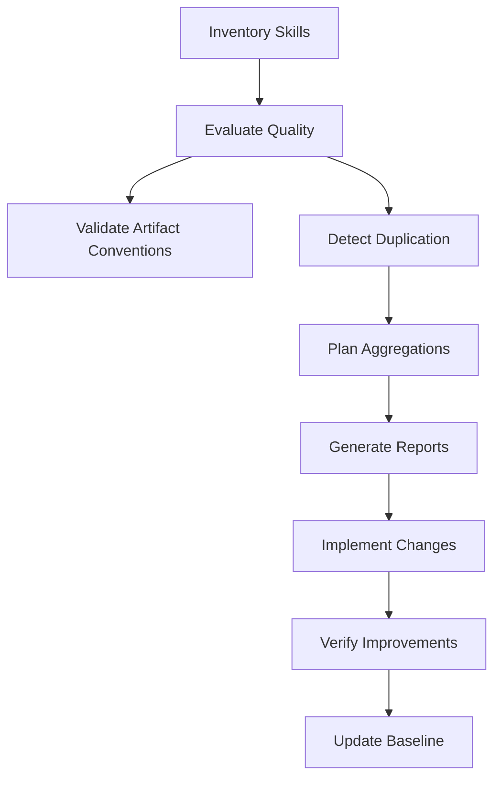

# Skill Quality Auditor

Automated skill quality evaluation and maintenance using the skill-judge framework. Detects duplication, evaluates quality across 8 dimensions, recommends aggregations, and tracks skill health over time.

## When to Apply

Use this skill when:

- **Quarterly audits** - Regular skill collection health checks
- **New skill review** - Evaluating newly created skills before merge
- **Aggregation planning** - Identifying related skills to consolidate
- **Quality enforcement** - Ensuring skills meet A-grade standards (≥108/120)
- **Duplication detection** - Finding redundant content across skills
- **Health monitoring** - Tracking skill collection metrics over time
- **CI/CD integration** - Automated quality gates in pull requests

## Categories by Priority

| Priority | Category | Impact | Prefix | Files |
|----------|----------|--------|--------|-------|
| **CRITICAL** | Evaluation Framework | Foundational | `framework-` | 4 |
| **HIGH** | Duplication Detection | High ROI | `duplication-` | 2 |
| **HIGH** | Aggregation Planning | High ROI | `aggregation-` | 2 |
| **MEDIUM** | Automation Scripts | Efficiency | `scripts-` | 2 |
| **MEDIUM** | Reporting & Analysis | Visibility | `reporting-` | 2 |
| **LOW** | Advanced Features | Optional | `advanced-` | 2 |

## How to Use This Skill

This skill follows **progressive disclosure** - start with what you need:

### Quick Start

1. Load this skill (you just did)
2. Run basic audit: `./scripts/audit-skills.sh`
3. Review generated reports in `.context/analysis/skill-audit-YYYY-MM-DD.md`

### Deep Evaluation

1. Read `framework-skill-judge-canonical.md` for canonical framework source
2. Read `framework-skill-judge-dimensions.md` for normalized 8-dimension criteria
3. Read `framework-scoring-rubric.md` for scoring methodology
4. Apply evaluation to individual skills

### Duplication Detection

1. Read `duplication-detection-algorithm.md` for methodology
2. Run `./scripts/detect-duplication.sh` to find >20% similarity
3. Review recommendations in generated report

### Aggregation Planning

1. Read `aggregation-pattern.md` for Navigation Hub pattern
2. Read `aggregation-implementation.md` for step-by-step guide
3. Identify candidates using duplication + family analysis
4. Calculate ROI: (hours saved / hours invested)

### Automation

1. Read `scripts-audit-workflow.md` for automation setup
2. Read `scripts-ci-integration.md` for GitHub Actions/GitLab CI
3. Configure quality gates (block PRs with C-grade skills)

### Advanced

1. Read `advanced-trends-analysis.md` for historical tracking
2. Read `advanced-custom-metrics.md` for domain-specific evaluation

## Core Workflow



## Artifact Convention Enforcement

Use this skill to enforce deterministic artifact rules across all skills:

- Files in `templates/` MUST be YAML (`.yaml` or `.yml`).
- Files in `schemas/` MUST be JSON Schema files named `*.schema.json` and include a `"$schema"` URL from `json-schema.org`.
- Files in `scripts/` MUST be portable shell scripts (`.sh`) with `#!/usr/bin/env sh`, and pass `sh -n`.

Run:

```bash
./skills/skill-quality-auditor/scripts/validate-skill-artifacts.sh
```

For staged files in commits, enforcement is also wired through `lefthook` pre-commit.

## Success Metrics

After applying this skill, you should achieve:

- **Quality**: 90%+ skills at A-grade (≥108/120)
- **Duplication**: <5% redundant content across collection
- **Size**: Average skill <150 lines (navigation hubs <100 lines)
- **Clarity**: Zero confusion about which skill to use
- **Maintenance**: Updates require changing only 1 file per concept

## Quick Reference

**Evaluate a single skill:**

```bash
bun run .agents/skills/skill-quality-auditor/scripts/evaluate.ts skill-name
```

**Find duplicates:**

```bash
./scripts/detect-duplication.sh
```

**Plan aggregation:**

```bash
bun run scripts/plan-aggregation.ts --family bdd
```

**Full audit:**

```bash
./scripts/audit-skills.sh --output .context/analysis/
```

## Anti-Patterns

### ❌ Never run audits without baseline comparison

**WHY:** Without baseline, you cannot detect regression or measure improvement.

```bash
# BAD - No baseline comparison
./scripts/audit-skills.sh > report.md
# Next quarter: same command, no way to compare

# GOOD - Track baseline for comparison
./scripts/audit-skills.sh --baseline .context/baselines/quarterly.md
# Compare: diff .context/baselines/q1.md .context/baselines/q2.md
```

**Consequence:** Quality regressions go unnoticed; impossible to prove ROI.

### ❌ Never aggregate skills with <20% similarity

**WHY:** Low-similarity skills have different purposes; merging creates confusion.

```markdown
# BAD - 12% similarity, different purposes
bdd-testing + typescript-advanced → "testing-and-types" (confusing)

# GOOD - 42% similarity, related domain
bdd-gherkin + cucumber-best-practices → "bdd-testing" (clear purpose)
```

**Consequence:** Users cannot find the right skill; maintenance burden increases.

### ❌ Never skip verification after aggregation

**WHY:** Aggregation changes file paths and references, breaking downstream dependencies.

```bash
# BAD - No verification
mv skills/bdd-gherkin skills/bdd-testing/references/
# References to skills/bdd-gherkin now broken

# GOOD - Verify all references
grep -r "skills/bdd-gherkin" . --include="*.md"
# Fix all references before committing
```

**Consequence:** Dead links, broken imports, confused users.

### ❌ Never create aggregations with >10 source skills

**WHY:** Large aggregations become unwieldy and lose focus.

```markdown
# BAD - 15 skills aggregated
"frontend-development" ← react, vue, angular, svelte, css, html, ...

# GOOD - 3-5 related skills
"react-patterns" ← react-hooks, react-state, react-testing
```

**Consequence:** Skill becomes a "kitchen sink"; users cannot navigate efficiently.

### ❌ Never create multi-purpose skills

**WHY:** Skills covering multiple tasks confuse users about when to activate.

```markdown
# BAD - Two different tasks in one skill
name: testing-and-deployment
description: Write tests and deploy applications to production.
# User asks: "How do I write a unit test?" → Unclear which part applies

# GOOD - Single-purpose skill
name: unit-testing
description: Write unit tests with Jest, Vitest, or Mocha. Use when creating test files, writing test cases, or mocking dependencies.
# Clear: skill activates for test writing only
```

**Consequence:** Wrong skill activates; user gets irrelevant guidance; skill collection becomes unmanageable.

### ❌ Never ignore C-grade skills for >1 quarter

**WHY:** Low-quality skills accumulate technical debt and mislead users.

```markdown
# BAD - C-grade skill ignored for 6 months
skill-x: 72/120 (D grade)
# No action taken, skill quality degrades further

# GOOD - Action plan within quarter
skill-x: 72/120 (D grade)
Action: Apply aggregation or refactor within 30 days
```

**Consequence:** Skill collection degrades; users lose trust in quality standards.

## Related Skills

- **skill-judge** - Foundation evaluation framework (integrated under `references/framework-skill-judge-canonical.md`)
- **skill-harvester** - Creates new skills from git history (quality check with auditor after)
- **architecture-design** - Use for designing skill structure decisions
- **proof-of-work** - Verification philosophy applied to skill changes

## References

All detailed content has been moved to the `references/` directory. Load on-demand based on your task:

- **Framework** (CRITICAL) - Evaluation methodology
- **Duplication** (HIGH) - Detection and remediation
- **Aggregation** (HIGH) - Consolidation patterns
- **Scripts** (MEDIUM) - Automation tools
- **Reporting** (MEDIUM) - Analysis and visualization
- **Advanced** (LOW) - Trends and custom metrics

See `AGENTS.md` for complete file listing.
