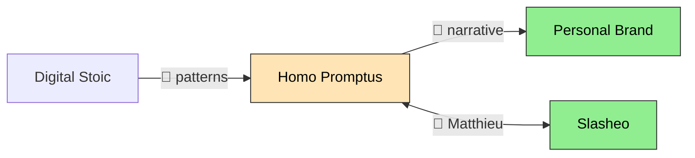

# Bridge — Cross-Project Connection Capture

Capture cross-project bridges in the moment, while you're in context. Bridges are knowledge — they live in a bridges directory, not in project artifacts.

## Why

Bridges are discovered during work, not during planning. When you're deep in a meeting and realize "this pattern connects to another project" — that's when `bridge` captures it.

## Step 0: Load Config

Read the project config file (path configured via `$PRAXIS_DIR` or equivalent). This file contains:
- Project aliases (keys), names, roles, tiers, goals, flywheel roles
- Stakeholders with `also_in` cross-references (for people-bridge detection)
- GTD and praxis paths

Use project YAML keys as aliases (case-insensitive matching). If a user types a project name instead of alias, fuzzy-match against `name` fields.

If config missing → `⚠️ No project config found. Create it with your project definitions.`

## Archetypes

Every bridge has a type. The 10 archetypes:

| Code | Archetype | One-liner |
|---|---|---|
| `flywheel` | 🔄 Flywheel loop | Output of A feeds B feeds C → back to A |
| `knowledge` | 🧠 Knowledge cascade | Framework/learning from one domain reusable in another |
| `people` | 👤 People-bridge | Same person carries context across projects |
| `terrain` | 🌱 Terrain d'essai | One project is live lab for methods used in another |
| `narrative` | 📖 Narrative amplifier | One project generates stories that make another credible |
| `identity` | 🎭 Identity coherence | Projects collectively tell a story about who you are |
| `complexity` | 🔬 Complexity lab | Managing complexity in one domain trains patterns for another |
| `local` | 🤝 Local network overlay | Geographic proximity creates compound serendipity |
| `option` | ⚡ Option value | One project creates future optionality for another |
| `mirror` | 🪞 Mirror project | Introspective insights reshape how other projects are framed |

## Commands

| Command | Action |
|---|---|
| `/bridge <src> → <tgt>: <desc>` | Capture a bridge (auto-detect archetype) |
| `/bridge <src> → <tgt> [type]: <desc>` | Capture with explicit archetype |
| `/bridge list` | Show recent bridges (last 10) |
| `/bridge list <project>` | Show bridges involving a project |
| `/bridge map` | Generate mermaid bridge map from all captures |
| `/bridge stats` | Weekly summary — counts by project and archetype |

## Storage

**Directory:** Bridges directory (e.g., `thinking/bridges/` under your configured workspace root)

Each bridge is a YAML file: `{date}-{seq}-{source}-to-{target}.yaml`

Example: `2026-04-08-1-hp-to-brand.yaml`

**Sequence**: Within a day, increment seq (1, 2, 3...). Check existing files for the day to determine next seq.

### Schema

```yaml
source: HP
target: BR
archetype: narrative
emoji: 📖
description: "Philosopher council on construct AI → reframes human-centric positioning from marketing to philosophy"
direction: one-way  # one-way | bidirectional
strength: potential  # active | potential | theoretical
context: "During introspect session, realized philosopher encounters are unique differentiator"
date: 2026-04-08
```

**Fields:**
- `source`, `target`: Project alias (uppercase, from config keys)
- `archetype`: One of the 10 codes
- `emoji`: Archetype emoji
- `description`: The bridge itself — what flows from source to target
- `direction`: `one-way` (A→B only) or `bidirectional` (A↔B, create one file with note)
- `strength`: `active` (happening now), `potential` (could happen, not activated), `theoretical` (speculative)
- `context`: Optional — what triggered the discovery (session, meeting, realization)
- `date`: ISO date

## Capture (`/bridge <args>`)

### Parse Arguments

Input: `/bridge HP → BR: philosopher encounters reframe human-centric positioning`

1. Split on `→` to get source and rest
2. Split rest on `:` to get target (+ optional `[type]`) and description
3. Resolve aliases against config keys (case-insensitive). If no match, fuzzy-match against `name` fields.
4. If `[type]` present, use it; otherwise auto-detect archetype

### Auto-Detect Archetype

If no explicit type, use two signals:

**Signal 1 — Keywords in description:**
- "pattern", "framework", "method", "learned", "reusable" → `knowledge`
- Person name (check config stakeholders) or "carries context", "cross-pollinates" → `people`
- "story", "credibility", "proof", "case study" → `narrative`
- "test ground", "lab", "experiment", "tried in" → `terrain`
- "loop", "feeds back", "cycle" → `flywheel`
- "brand", "who I am", "positioning", "identity" → `identity`
- "admin", "bureaucracy", "same skill", "transfers" → `complexity`
- "local", "geographic" → `local`
- "future", "optionality", "if it works", "unlocks" → `option`
- "introspect", "philosopher", "reframe", "reshape" → `mirror`

**Signal 2 — Config context:**
- If source or target has `flywheel_role: terrain` → lean toward `terrain`
- If source or target has `flywheel_role: mirror` → lean toward `mirror`
- If a stakeholder name appears in description and has `also_in` → `people`

If ambiguous, default to `knowledge` and mention in response.

### Detect Direction & Strength

- Default: `one-way`, `potential`
- If description contains "↔" or "bidirectional" or "both ways" → `bidirectional`
- If description contains "already", "happening", "active", "doing this" → `active`
- If description contains "could", "should", "would", "not yet" → `potential`
- If description contains "maybe", "speculative", "in theory" → `theoretical`

### Write File

1. Guard: check workspace root is configured. If not: `⚠️ Workspace root not set. Configure via environment variable (e.g. export PRAXIS_DIR="$HOME/dev/praxis")`
2. Create bridges directory if it does not exist
3. Determine seq: count existing `{date}-*` files + 1
4. Write YAML file
5. Respond (one line): `🔗 Bridge #N: {emoji} {source} → {target} ({archetype}) — {short desc}`
6. **Weekly nudge** (optional): count bridges this week. If ≥3 involving same project pair: append `📊 {N} bridges this week involving {pair}. Consider updating strategic bridges during review.`
7. **Resume prior work immediately.**

## List (`/bridge list [project]`)

1. `Glob` for all YAML files in bridges directory
2. Read each file, parse YAML
3. If project filter: match against config aliases or names (case-insensitive)
4. Sort by date desc, show last 10
5. Display:

```
🔗 Bridges (last 10)
  1. 2026-04-08 📖 HP → BR: philosopher encounters reframe positioning (potential)
  2. 2026-04-08 🧠 BNP → HP: observability patterns = atelier content (active)
  3. 2026-04-07 👤 HP ↔ SL: Matthieu carries context both ways (active)
```

If empty: `🔗 No bridges captured yet. Use /bridge <source> → <target>: <description>`

## Map (`/bridge map`)

1. Read config for project names (display labels)
2. Read all bridge files
3. Generate mermaid graph using config names as node labels:



1. Group by strength (active=green, potential=orange, theoretical=pink)
2. Output the mermaid block

## Stats (`/bridge stats`)

1. Read all bridge files
2. Read config for tier info
3. Count by: project (as source + target), archetype, strength, tier, this-week vs all-time
4. Display:

```
📊 Bridge Stats
  This week: 5 bridges
  All time: 23 bridges

  By project (top 5):
    HP: 12 (6→, 6←) [tier 1]
    BR: 8 (2→, 6←) [tier 1]
    DS: 7 (5→, 2←) [tier 1]

  By archetype:
    🧠 knowledge: 8
    📖 narrative: 6
    👤 people: 4

  By strength:
    🟢 active: 9
    🟡 potential: 11
    🔴 theoretical: 3

  Tier 2 bridges: 3 (VN→HP, VN→BR, LW→HP)
```

## Key Behaviors

- **One-line capture response.** Never add commentary about bridge content.
- **Resume immediately.** After capture, pick up prior conversation exactly where it left off.
- **Store verbatim.** No reformulation of user's description.
- **Auto-detect but don't over-think.** If archetype is ambiguous, pick the closest and move on.
- **Weekly nudge, not nag.** Mention reconciliation opportunity only when pattern is clear (≥3 same pair).
- **No GTD writes.** This skill only writes to the bridges directory. Strategic bridge summaries are updated manually during weekly review.
- **Config-driven.** All project aliases come from the configured project YAML. If a project isn't in config, warn and suggest adding it.

## When to Use

- A cross-project pattern or shared method surfaces mid-conversation and you want to capture it before the context is lost.
- You hear yourself (or the user) say phrases like "this is the same as", "this connects to", "this feeds into", or "same pattern as" another project.
- A person is mentioned who works across two projects and carries meaningful context between them (people-bridge signal).
- You finish a session and realise one project generated a story, case study, or proof point that strengthens another.
- A project is being used as a live test-bed for methods intended for a different project (terrain signal).

## When Not to Use

- The connection is purely administrative (shared calendar, same Slack channel) with no knowledge or value transfer.
- Both "projects" are the same project under different names — use project config aliasing instead.
- The user is mid-decision and does not want their flow interrupted; wait for a natural pause or explicit `/bridge` invocation.
- The link is already captured: check `/bridge list` before writing a duplicate.
- You are inside a weekly review session already updating strategic summaries — bridges are for in-the-moment capture, not retrospective logging.

## Anti-Patterns

- **NEVER reformulate the user's description** — store the exact wording as given. **Why:** paraphrasing introduces your interpretation and erases the original mental model that triggered the insight.
- **NEVER add unsolicited commentary on bridge content** — the response is one line only. **Why:** this skill is a capture tool, not an analysis tool; commentary derails the primary conversation.
- **NEVER write to GTD task files or project artifacts** — only write to the bridges directory. **Why:** mixing bridge captures into task lists pollutes both systems and breaks single-responsibility.
- **NEVER guess a project alias that is not in config** — warn and prompt the user to add it. **Why:** silent alias invention creates inconsistent data that breaks `/bridge list`, `/bridge map`, and stats aggregation.
- **NEVER skip the seq check** — always count existing files for the day before assigning a sequence number. **Why:** collisions overwrite existing bridge captures with no warning.

## Usage Examples

**Capturing a knowledge bridge mid-session:**

```bash
# User is in a meeting and realises a framework from one project applies to another
/bridge PROJ-A → PROJ-B: observability patterns from service mesh apply directly to the atelier content structure
# Skill writes: 2026-04-11-1-proj-a-to-proj-b.yaml  (archetype: knowledge, strength: potential)
# Response: 🔗 Bridge #1: 🧠 PROJ-A → PROJ-B (knowledge) — observability patterns from service mesh apply directly to the atelier content structure
```

**Capturing a people-bridge with bidirectional flow:**

```bash
# A stakeholder carries context in both directions between two projects
/bridge PROJ-A ↔ PROJ-C [people]: Matthieu carries positioning context both ways and cross-pollinates priorities
# Skill detects '↔' → direction: bidirectional; 'Matthieu' in stakeholders → archetype: people
# Response: 🔗 Bridge #2: 👤 PROJ-A ↔ PROJ-C (people) — Matthieu carries positioning context both ways
```

**Listing recent bridges and generating a visual map:**

```bash
/bridge list PROJ-A
# Returns last 10 bridges involving PROJ-A, sorted by date desc

/bridge map
# Returns a mermaid graph block with all captured bridges coloured by strength
```

## References

- [Personal Knowledge Management — Linking Your Thinking](https://www.linkingyourthinking.com/)
- [YAML Specification — Block Scalars](https://yaml.org/spec/1.2-old/spec.html#id2794534)
