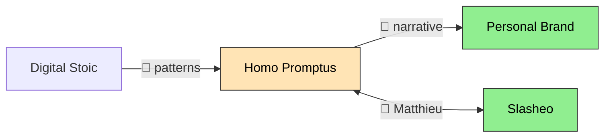

# List, Map and Stats Output

Detail for the read-only subcommands. None of them creates or edits a file.

## List (`/bridge list [project]`)

1. Glob every YAML file in the bridges directory.
2. Read each file and parse the YAML.
3. With a project filter, match against config aliases and `name` fields, case-insensitively, on either side of the bridge.
4. Sort by `date` descending, using filename sequence to break ties, and keep the last 10.
5. Print one line each. Use `→` for one-way and `↔` for bidirectional, and always show the strength:

```text
🔗 Bridges (last 10)
  1. 2026-04-08 📖 HP → BR: philosopher encounters reframe positioning (potential)
  2. 2026-04-08 🧠 BNP → HP: observability patterns = atelier content (active)
  3. 2026-04-07 👤 HP ↔ SL: Matthieu carries context both ways (active)
```

Empty or missing directory: `🔗 No bridges captured yet. Use /bridge <source> → <target>: <description>`. Do not return nothing.

## Map (`/bridge map`)

1. Read the config for project names, which become the node labels.
2. Read every bridge file.
3. Colour nodes by strength: active green, potential orange, theoretical pink.
4. Print the mermaid block and nothing else:



## Stats (`/bridge stats`)

1. Read every bridge file and the config tier information.
2. Count by project (as source and as target), archetype, strength and tier, for this week and all time.
3. Print:

```text
📊 Bridge Stats
  This week: 5 bridges
  All time: 23 bridges

  By project (top 5):
    HP: 12 (6→, 6←) [tier 1]
    BR: 8 (2→, 6←) [tier 1]

  By archetype:
    🧠 knowledge: 8
    📖 narrative: 6

  By strength:
    🟢 active: 9
    🟡 potential: 11
    🔴 theoretical: 3
```

Report counts exactly as read. Do not interpret them or recommend actions.
